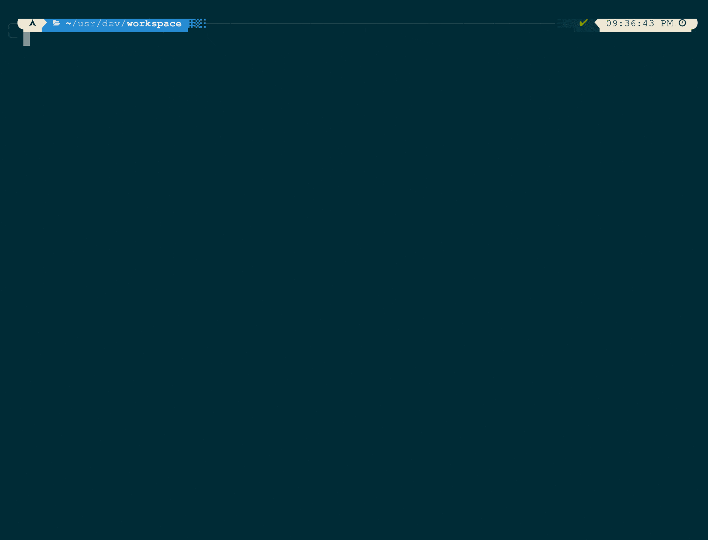

# where-is
<p float="left">
  
                                    
> An elegant way of getting configuration files (and folders)


# Getting started
## Prerequisites
- Unix/NT Based OS
- Python>=3.6
- Pip

## Installation
1. Install `where-is` using `pip`.

```bash
$ pip install where-is
```

## Basic Usage
### Get config locations of `grub`
```bash
$ where-is find grub
```
### Add an entry
```bash
$ where-is database --add
```
### Remove an entry
```bash
$ where-is database --remove
```

# More information
For more information and graphics, [see the wiki.](https://github.com/what-to-code-complete/where-is/wiki)

# Built with
- [Rich](https://github.com/willmcgugan/rich): For rich text and beautiful formatting
- [Typer](https://github.com/tiangolo/typer): Used as the argument parser
- [Black](https://github.com/psf/black): Used as the formatter
- [Pipenv](https://github.com/pypa/pipenv): Used as the virtualenv manager

# Acknowledgements
- [joereynolds/what-to-code](https://github.com/joereynolds/what-to-code): For inspiration to make this project
- [Logomakr](https://logomakr.com/): Used to make the logo

# License
This project is licensed under the GNU GPLv3 License - see this [LICENSE.md](https://raw.githubusercontent.com/what-to-code-complete/where-is/master/LICENSE) file for details
