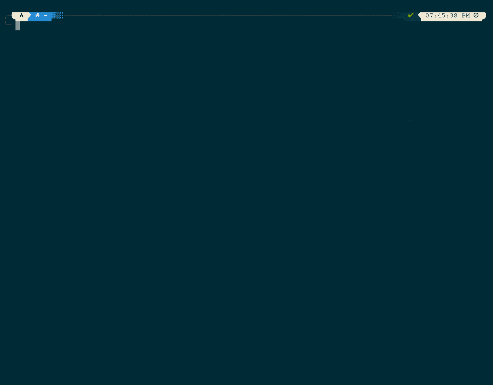

# where-is
<p float="left">
  
  
</p>
                                    
> An elegant way of getting configuration files (and folders)


# Getting started
## Prerequisites
- Unix/NT Based OS
- Python>=3.6
- Pip

## Installation
1. Install `where-is` using `pip`.

```bash
$ pip install where-is
```

## Usage
Get the config of `grub`.

```bash
$ where-is grub
```

## Configuration
Where:

`$NAME` is the name of the entry

`$LOCATIONS ...` is the locations

`$DATABASE_FOLDER` is the database folder (default is the where-is config folder)

```json
{
  "name": "$NAME",
  "locations": [
    ["$LOCATIONS", "..."]  
  ] 
}
```

Example:
```json
{
  "name": "bash",
  "locations": [
      ["{HOME}", ".bashrc"],
      ["{HOME}", ".bash_logout"],
      ["{HOME}", ".bash_profile"],
      ["{HOME}", ".bash_history"]
  ]
}
```

Write the following information to:
- Linux: `~/.config/where-is/$NAME.json`
- Mac: `~/Library/Preferences/where-is/$NAME.json`
- Windows: `%APPDATA%\where-is\$NAME.json`

... or `$DATABASE_FOLDER`

# Built with
- [Rich](https://github.com/willmcgugan/rich): For rich text and beautiful formatting
- [Typer](https://github.com/tiangolo/typer): Used as the argument parser
- [Black](https://github.com/psf/black): Used as the formatter
- [Pipenv](https://github.com/pypa/pipenv): Used as the virtualenv manager

# License
This project is licensed under the GNU GPLv3 License - see this [LICENSE.md](https://raw.githubusercontent.com/what-to-code-complete/where-is/master/LICENSE) file for details
